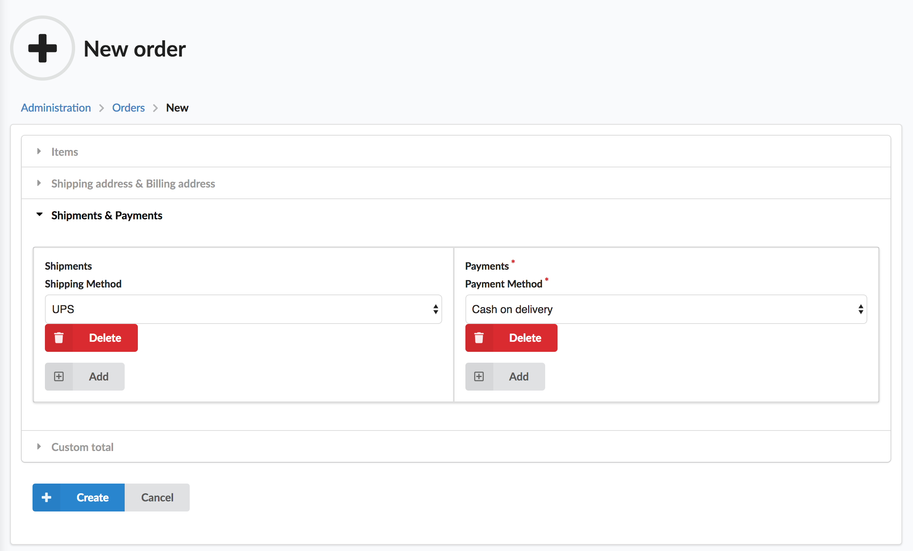

<p align="center">
    <a href="https://sylius.com" target="_blank">
        
    </a>
</p>

<h1 align="center">Admin Order Creation Plugin</h1>

<p align="center">This plugin allows to create an order in admin panel.</p>



## Installation

1. Require plugin with composer:

    ```bash
    composer require sylius/admin-order-creation-plugin
    ```

2. Import configuration:

    ```yaml
    imports:
        - { resource: "@SyliusAdminOrderCreationPlugin/Resources/config/app/config.yml" }
    ```

3. Import routing:

    ```yaml
    sylius_admin_order_creation:
        resource: "@SyliusAdminOrderCreationPlugin/Resources/config/app/routing.yml"
    ```

4. Add plugin class to your `AppKernel`:

    ```php
    $bundles = [
        new \FOS\JsRoutingBundle\FOSJsRoutingBundle(), //used by plugin
        new \Sylius\AdminOrderCreationPlugin\SyliusAdminOrderCreationPlugin(),
    ];
    ```

5. Copy templates from `vendor/sylius/admin-order-creation-plugin/src/Resources/views/SyliusAdminBundle/` 
   to `app/Resources/SyliusAdminBundle/views/`.

6. Copy migrations from `vendor/sylius/admin-order-creation-plugin/migrations/` 
   to your migrations directory and run `bin/console doctrine:migrations:migrate`.

7. Install `FOSJsRoutingBundle` assets:

    ```bash
    bin/console assets:install --symlink web
    ```

8. Clear cache:

    ```bash
    bin/console cache:clear
    ```

### Known issues

* Js providing eligible shipping methods during order creation works only for the first shipment (for the case of new feature simplicity).
It will be fixed in one of the future PRs.
